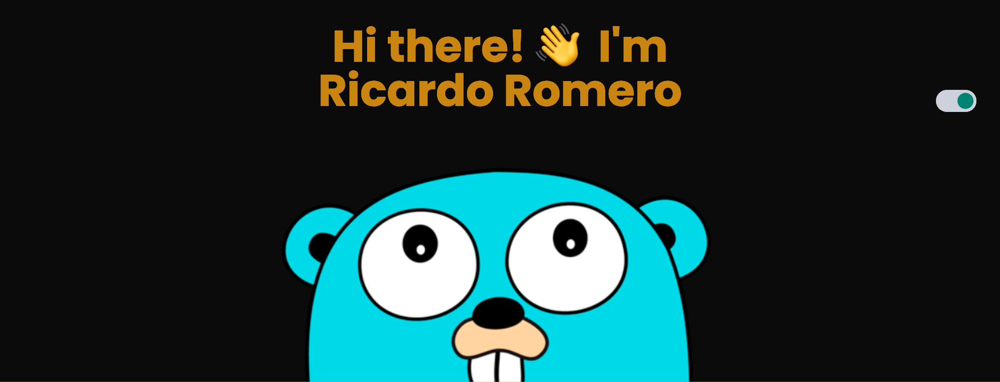

---

- 🔭 I’m currently working on _Freelance_
- 🌱 I’m currently learning _Web3 and Blockchain_
- 👯 I’m looking to collaborate on _Startups_
- 🤔 I’m looking for help with _Personal Company_
- 💬 Ask me about _Microservices and Blockchain_
- 📫 How to reach me: _**ricardo.jonathan.romero@gmail.com**_

### My GitHub Stats 🗿

---
 

### My Trophies

---

### What I'm listening 🎧

---

